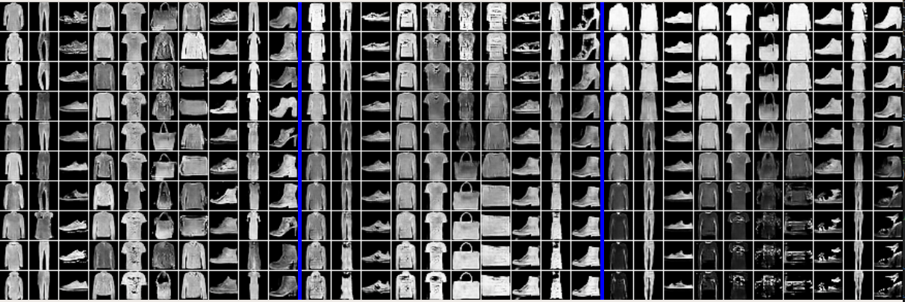

[GAN](#GAN)
[DCGAN](##DCGAN)
[Image2Image](##Image2Image)
[InfoGAN-mnist](##InfoGAN-mnist)
[ConditionalGAN-mnist](##ConditionalGAN-mnist)
[WGAN,Improved-WGAN,BEGAN](##WGAN,Improved-WGAN,BEGAN)
[CycleGAN,DiscoGAN-CelebA](##CycleGAN,DiscoGAN-CelebA)

---
# [GAN](https://github.com/tensorpack/tensorpack/blob/master/examples/GAN)
## DCGAN

1、下载[CelebA数据集](http://mmlab.ie.cuhk.edu.hk/projects/CelebA.html)的'aligned&cropped'版本

2、training

```
python3 DCGAN.py --data /path/to/img_align_celeba/ --crop-size 140
```
3、使用现有模型可视化样本：

```python
python3 DCGAN.py --load path/to/model --sample
# 如：
python3 DCGAN.py --load DCGAN-CelebA.npz --sample
# 注需修改DCGAN.py 52行，64行，将kernel_size修改为5
# 在生成的图片界面按 ESC 切换到新的生成图
```


4、训练自己的图像
（只需使用任何jpg文件目录）`--data`）。 但可能需要更改预处理。

A pretrained model on CelebA is at http://models.tensorpack.com/GAN/

---
## Image2Image
使用图像对训练图像到图像的转化模型，原始 [pix2pix](https://github.com/phillipi/pix2pix)：

```python
./Image2Image.py --data /path/to/datadir --mode {AtoB,BtoA}
#datadir应该包含由A和B组成的shpae 2s x s的jpg图像
#您可以从原作者那里下载一些数据：
# https://people.eecs.berkeley.edu/~tinghuiz/projects/pix2pix/datasets/
```

测试集可视化：

```
 ./Image2Image.py --sample --data /path/to/test/datadir --mode {AtoB,BtoA} --load model
```
## InfoGAN-mnist
重现InfoGAN中的mnist体验。 它假设10个潜在变量对应于分类分布，2个潜在变量对应于均匀分布。 然后，它最大化这些潜在变量和图像之间的互信息，并学习可解释的潜在表示。

1、train
```
./InfoGAN-mnist.py
```
2、visualize

```
./InfoGAN-mnist.py --sample --load path/to/model
```


## ConditionalGAN-mnist
在mnist上训练一个简单的GAN，以类标签为条件。

1、train

```
./ConditionalGAN-mnist.py
```
2、visualize

```
./ConditionalGAN-mnist.py --sample --load path/to/model
```
## WGAN,Improved-WGAN,BEGAN
Improved-WGAN改进的`Wasserstein-GAN`。

BEGAN边界平衡GAN。

有关用法，请参阅`DCGAN`。


## CycleGAN,DiscoGAN-CelebA
使用原始数据集重现CycleGAN，并在CelebA上重现DiscoGAN。 它们与不同的架构几乎相同。 在tensorboard中的CycleGAN马到斑马：

1、从原始项目下载数据集
https://github.com/junyanz/CycleGAN#train

2、Training and testing visualizations will be in tensorboard

```
./CycleGAN.py --data /path/to/datasets/horse2zebra
```
此实现不使用伪样本缓冲区。
添加并不难，但我没有发现任何差异。

