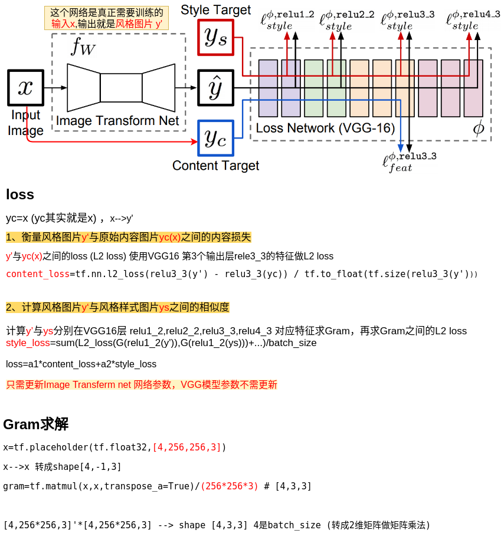
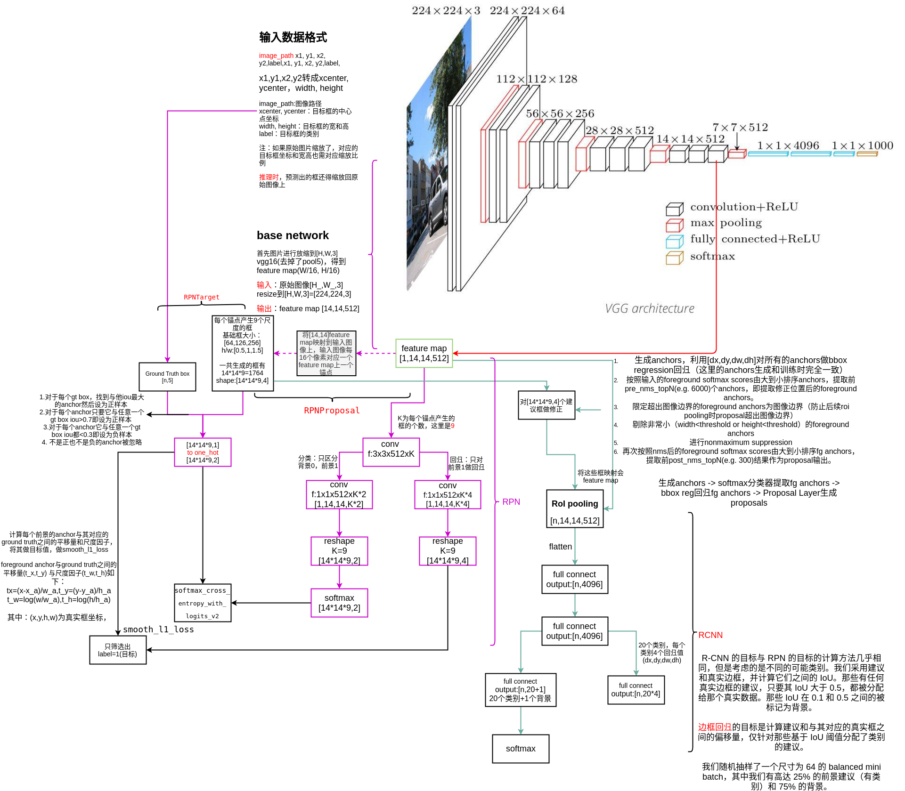

# cyclegan
参考：

1、https://arxiv.org/abs/1703.10593

2、https://zhuanlan.zhihu.com/p/27145954

# pix2pix
参考：

1、https://arxiv.org/pdf/1611.07004v1.pdf

2、https://github.com/yenchenlin/pix2pix-tensorflow

# SRCNN
参考：

1、http://101.96.10.63/personal.ie.cuhk.edu.hk/~ccloy/files/eccv_2014_deepresolution.pdf

2、https://blog.csdn.net/jacke121/article/details/80574397

# SRGAN
参考：

1、https://arxiv.org/pdf/1609.04802.pdf

2、https://github.com/brade31919/SRGAN-tensorflow

# VAE
参考：

1、https://arxiv.org/abs/1312.6114

2、https://www.cnblogs.com/huangshiyu13/p/6209016.html

# Style Transfer
参考：

1、https://arxiv.org/pdf/1603.08155.pdf

2、https://blog.csdn.net/qq_25737169/article/details/79192211

# faster rcnn
参考：
- https://github.com/tryolabs/luminoth
- https://tryolabs.com/blog/2018/01/18/faster-r-cnn-down-the-rabbit-hole-of-modern-object-detection/
- https://www.tinymind.cn/articles/656
- https://zhuanlan.zhihu.com/p/31426458
- https://blog.csdn.net/u013010889/article/details/78574879

